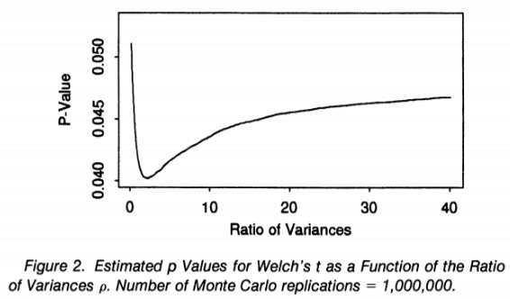

우리가 검정을 수행하는 방법에는 크게 두 가지가 있습니다. 첫째는 적당한 검정통계량과 그 귀무가설의 영분포, 기각역을 구한 뒤 표본으로부터 얻은 검정통계량이 여기에 속하는지 확인하는 것입니다. 둘째는 p값을 구하고 이 p값이 유의수준 $\alpha$와 비교하여 작으면 귀무가설을 기각하는 방법입니다. 

한편 이렇게 p값을 구하여 가설을 검정하려 할 때, 자주 접하는 상황은 검정에서 관심이 있는 모수인 **목적모수(target parameter)**가 아닌 다른 모수, 즉 **장애모수(nuisance parameter)**가 검정에 필요한 상황입니다. 이 경우 우리는 장애모수에 대한 어떠한 추론도 원하지 않지만, 검정을 위하여 장애모수가 필요합니다.

### Pedagogical Example About a Normal Mean
간단한 상황으로, 
\[X_i \sim_{i.i.d} N(\mu, \sigma^2), \quad i = 1, 2, \cdots, n\]
의 표본을 얻어 
\[H_0: \mu = \mu_0, \; \text{vs.} \; H_1: \mu \neq \mu_0\]
을 검정하는 상황을 고려하여 봅시다. 이 경우 모수모형에는 $\sigma^2$이 포함되면서, 가설 검정과 추론에서는 관심을 주지 않기에 $\sigma^2$은 장애모수입니다. 

만약 $\sigma^2$이 어떤 값인지 알고 있다면, 가장 효율적인 검정은 z-통계량
\[Z = \dfrac{\sqrt{n}(\bar{X} - \mu_0)}{\sigma}\]
를 사용해 검정을 진행하는 것이며, 양방향 p값은 $\sigma^2$에 대한 함수 
\[p(\sigma^2) = 2\Phi(-|z_{\text{obs}}|)\]
으로 얻어지는 것이 일반적입니다.

그러나 $\sigma^2$이 무슨 값인지 모른다면, 우리는 그 검정을 위하여 t-검정을 주로 사용합니다. 다르게 말하면, $\sigma^2$을 추정해야 하는 과정이 부차적으로 들어가야 하며, 표본분산 $s^2$에 관련한 적절한 검정 방법이 개발되어 있어야만 합니다. 이 케이스는 매우 간단하기에 다행히도 t-검정을 사용하면 되지만, 그러지 못한 경우가 더욱 많습니다.

### Behrens-Fisher Problem
두 독립 표본
\[X_i \sim_{i.i.d} N(\mu_1, \sigma_1^2), \quad i = 1, 2, \cdots, m\]
\[Y_j \sim_{i.i.d} N(\mu_2, \sigma_2^2), \quad j = 1, 2, \cdots, n\]
에 대하여
\[H_0: \mu_1 = \mu_2, \; \text{vs.} \; H_1: \mu_1 \neq \mu_2\]
를 검정하는 상황을 고려합시다. 일반적으로, 우리가 $\sigma_1^2$과 $\sigma_2^2$이 같으며 그 값을 정확히 아는 경우에는 단순히 z-검정을 사용하면 됩니다. 반면, 그 값을 정확히 모르더라도 pooled estimator
\[s_p^2 = \dfrac{(m-1)s_1^2 + (n-1)s_2^2}{m+n-2}\]
를 사용하여 t-검정을 수행합니다. 허나 우리가 보고자 하는 Behrens-Fisher Problem에서는 $\sigma_1^2$과 $\sigma_2^2$이 다르다고 가정합니다.

이때 자주 사용하는 방법 중 하나는 Welch's t-test를 이용하는 것입니다. Welch의 검정통계량
\[t_w = \dfrac{\bar{X} - \bar{Y}}{\sqrt{\frac{s_1^2}{m} + \frac{s_2^2}{n}}}\]
은 적절한 자유도 $\nu = \nu(s_1^2, s_2^2, m, n)$의 t분포를 따름이 알려져 있습니다. 허나 이 방법은 특정한 $m, n$과 $\rho = \sigma_2^2/\sigma_1^2$의 조합 하에서 p값이 가져야 할 조건 중 하나인
\[P(p \le \alpha) \le \alpha, \; \forall \alpha \in {[0, 1]} \]
을 만족하지 못함이 알려져 있습니다. 다르게 말하면, 적절하지 못한 실험 상황에서는 검정이 불완전합니다. 

### Type 1 Error Rate and P value with Nuisance Parameter

따라서 우리는 검정의 과정에서 제1종의 오류율을 통제하기 위하여, 대개 목적모수 $\nu$와 장애변수 $\theta$에 대하여, 귀무가설이 $H_0: \nu = \nu_0$, 검정통계량이 $T$일 때,
\[p = \sup_{\theta} P_{\nu_0, \theta}(T \ge t_{obs})\]
를 자주 사용합니다. 즉 모수공간 내에서 장애변수가 어떠한 값을 취하더라도 우리가 구하는 p값으로써 기각확률, 혹은 제 1종의 오류율이 통제되는 상황을 만듭니다. 허나 이러한 방법은 $\sup$의 계산이 동반되기에, p값을 명시적으로 구하기 어렵습니다. 특히, 이는 수리적으로 어려울 뿐만 아니라  계산적으로도 어려운 문제입니다.

이를 해결하기 위해 사용되는 방법은 주로 아래와 같습니다.
- 검정의 결과에서, $\sup_{\theta}$가 얻어지는 $\theta$가 항상 $\theta_0$의 값으로 일정한 경우 단순히 $p = P_{\nu_0, \theta_0}(T \ge t)$를 이용합니다. 
- $H_0$에 대해 보조통계량이 되는 적절한 검정통계량 $T$를 찾아 그 영분포가 $\theta$에 무관하게 만들 수 있다면, $\sup_{\theta}$의 계산이 의미가 없어집니다.
- $H_0$ 하에서 $\theta$의 충분통계량이 되는 $S$를 찾고, 이에 대한 조건부확률 $p = P_{\nu_0}(T \ge t | S = s)$를 이용하 수 있습니다.
이들은 모두 결국 $\sup_{\theta}$의 계산을 한 번의 확률 계산으로 대체하는 동시에, 
\[P(p \le \alpha) \le \alpha, \; \forall \alpha \in {[0, 1]}\]
를 만족하는 p값을 내놓을 수 있습니다. 하지만 이러한 방법들은 매우 특별한 모형이 가정되었을 때에만 이용될 수 있습니다. 

### Confidence Interval Method
Berger와 Boos는 일반적인 상황에서도 nuisance parameter에 대한 confidence interval을 통해 적절한 p값을 내놓을 수 있는 방법을 제안하였습니다. 

먼저 nuisance parameter $\theta$에 대한 $1-\beta$ confidence interval을 $C_{\beta}$라고 하면, 
\[p_{\beta} = \min\left\lbrace\sup_{\theta \in C_{\beta}} p(\theta) + \beta, 1\right\rbrace\]
로 p값을 계산합니다. 일반적으로 $\alpha = 0.05$에 비하여 충분히 작은 $\beta = 0.001$ 혹은 $\beta = 0.0001$을 선택합니다. 이 방법은 $\sup_{\theta}$에 대한 계산을 unbounded set일 가능성이 높은 $\theta$의 모수공간 $\Theta$에서 수행하는 대신, 축소된 공간 $C_{\beta}$에서 수행한다는 점에서 수리적/계산적 복잡도를 감소시킵니다. 

그 증명은 매우 간단합니다. 귀무가설이 참이라고 하는 경우, $\beta \le \alpha$로 설정하므로, 
\[\begin{aligned} P(p_{\beta} \le \alpha) &= P(p_{\beta} \le \alpha, \theta_0 \in C_{\beta}) +  P(p_{\beta} \le \alpha, \theta_0 \notin C_{\beta})\\\\\\
&\le P(p(\theta_0) + \beta \le \alpha, \theta_0 \in C_{\beta}) + P(\theta_0 \notin C_{\beta})\\\\\\
&\le P(p(\theta_0) \le \alpha - \beta) + \beta\\\\\\
&\le \alpha - \beta + \beta = \alpha
\end{aligned}\]
이기 때문입니다. 

### Remedies for Previous Problems
먼저 일표본 검정에서 confidence interval method를 사용하여 보겠습니다. 우리는 분산 $\sigma^2$의 $1- \beta$ 신뢰구간이
\[C_{\beta} = \left\lbrace \sigma^2: 0 \le \sigma^2 \le \dfrac{(n-1)s^2}{\chi_{\beta, n-1}^2}\right\rbrace\]
임을 알며,
\[p_{\beta} = \sup_{\sigma^2 \in C_{\beta}} p(\sigma^2) + \beta = \sup_{\sigma^2 \in C_{\beta}} 2\Phi(-|z_{\text{obs}}|) + \beta\]
에서 $|z_{\text{obs}}|$는 $\sigma$에 대한 감소함수이므로 $\sup_{C_{\beta}}$는 $C_{\beta}$의 위쪽 끝에서 발생합니다(여기서 편의상 $p_{\beta}$가 1보다 작다고 하겠습니다.). 따라서 
\[p_{\beta} = 2\Phi(-|z_{\text{max}}|) + \beta, \; \text{where} \; z_{\text{max}} = \dfrac{(n-1)s^2}{\chi_{\beta, n-1}^2}\]
이며 이 역시 적절한 $p$값입니다. 

Behrens-Fisher Problem에서도 마찬가지입니다. $m$과 $n$이 고정되었을 때 귀무가설 하에서 $t_w$의 분포는 $\rho = \sigma_2^2/\sigma_1^2$의 값에만 의존합니다. Berger와 Boos는 이를 이용하여 $m = 9$, $n = 13$, $\mu_1 = 0$, $\mu_2 = 6.225$, $\sigma_1^2 = 18$, $\sigma_2^2 = 78$인 상황에서 $p$값을 구하였습니다. 이때 F분포를 따르는 $\rho$의 0.999 confidence interval(즉, $\beta = 0.001$)은 $(0.32, 38.72)$로 주어졌으며, 이 범위에서 
\[p_{0.001} = \sup_{\rho \in (0.32, 38.72)} p(\rho) + 0.001 = 0.049\]
로 나타나 유의수준 0.05에서 검정에 성공함을 확인할 수 있었습니다. 

{: .center}
다른 p값들과 비교해보면, Welch p값이 0.041, pooled t p값이 0.065, Behrens-Fisher p값이 0.050으로 confidence interval method가 기존의 방법과 유사한 p값을 제시함을 알 수 있습니다.

# References
Berger, R. L., & Boos, D. D. (1994). P values maximized over a confidence set for the nuisance parameter. Journal of the American Statistical Association, 89(427), 1012-1016.
